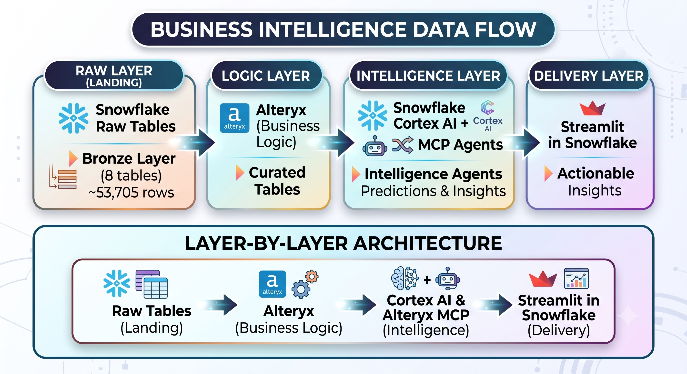

# Insurance Underwriting & Claims Analytics

## Unlocking Enterprise Value with Snowflake AI Data Cloud + Alteryx One Platform

In the insurance industry, profitability hinges on two critical capabilities: speed to decision in underwriting and accuracy with efficiency in claims processing. Traditional data pipelines often fragment business logic across legacy tools, delaying critical operational insights, increasing loss ratios, and creating severe governance risks through continuous data movement.

This enterprise reference architecture demonstrates how combining Snowflake’s AI Data Cloud and Alteryx One Platform bridges the gap between raw operational data and business-driven operational AI. By pairing Alteryx’s intuitive, business-owned transformation engine and insights capabilities with Snowflake’s high-performance data warehousing and AI capabilities, insurance carriers can:

- Eliminate Data Friction & Exposure: Transform massive operational datasets directly inside Snowflake using pushdown execution (Alteryx Live Query) eliminating pipeline latency, data egress costs, and compliance risks.

- Empower Domain Experts: Put logic creation directly into the hands of underwriters, adjusters, and risk analysts without relying on backlogged data engineering teams.

- Operationalize AI at Scale: Convert business-curated data products directly into AI insights. Leveraging Snowflake Cortex AI and Alteryx MCP Agents to automate fraud detection, prioritize claims, understand drivers for business activity, and generate executive narratives. 

---
## Core Business Value Drivers

- Proactive Fraud Risk Mitigation: Combined time-series anomaly detection and generative AI evaluate claims in real time, reducing claim leakage and lowering overall loss ratios.

- Accelerated Claims Triage & Settlement: Automated priority scoring (P1–P4) matches claims with optimal adjusters based on workload and specialization, boosting policyholder satisfaction and reducing cycle times.

- Dynamic Underwriting Performance: Curated 360-degree risk profiles provide transparent performance metrics, scorecards, and AI-driven coaching for underwriting staff.

- Zero-SQL Business Intelligence: Cortex Analyst (Semantic Views) and interactive Streamlit apps empower executives to query complex insurance metrics using plain English without writing a single line of SQL.

---

## The Platforms

### Snowflake AI Data Cloud

Snowflake's AI Data Cloud unifies data storage, processing, and AI under a single governed platform. It enables organizations to mobilize data for analytics, machine learning, and generative AI without managing infrastructure. With native Cortex AI capabilities, Snowflake brings intelligence directly to where data lives -- securely and at scale.

Capabilities leveraged:
- **Openflow (CDC)** -- Real-time change data capture from operational databases into Snowflake
- **Cortex LLM Functions** -- In-database generative AI for natural language generation, risk assessment, and personalized recommendations
- **Cortex ML Functions** -- Native time-series forecasting and anomaly detection
- **Cortex Analyst** -- Natural language to SQL via Semantic Views, enabling business users to query data in plain English
- **Streamlit in Snowflake** -- Interactive applications deployed natively within the data platform

### Alteryx One Platform

Alteryx One empowers domain experts and data professionals to prepare, blend, and transform data through intuitive, no-code/low-code workflows. The Alteryx One platform enables automation and seamless pushdown execution in Snowflake, allowing insurance teams to build repeatable, governed data pipelines that encode complex business logic without requiring deep engineering expertise. Additionally, with Alteryx Agents and MCP Server business users are able to leverage trusted data and insights in AI solutions such as Snowflake CoWork

Capabilities leveraged:
- **Live Query** -- Empowers business users to build no-code workflows and execute analytics directly within Snowflake without moving raw data 
- **Auto Insights** -- Delivers AI-driven pattern discovery and automated storytelling to uncover critical trends, root causes, and anomalies in insurance data
- **Alteryx AI Agents** -- Enables users to build AI agents in Alteryx Agent Studio and extend trusted business context to Snowflake AI agents through MCP integration
- **Orchestrator** -- Automated, scheduled execution of transformation workflows for continuous data freshness
- **Data Quality & Governance** -- Built-in profiling, cleansing, and standardization capabilities while adhering to the RBAC and security protocols enforced in Snowflake

---

## Solution Architecture

### Data Flow

1. **Raw Data:** Snowflake holds the operation insurance database and raw data -- customers, policies, underwriting decisions, claims, payments, adjsuters, underwriters, and risk factors (~53,705 rows across 8 tables)

2. **Create Snowflake Connection in Alteryx One:** Create data connection to Snowflake through OAuth and Key Pair Authentication. The Alteryx One data connection will only inherit the data privileges and RBAC that were provisioned in Snowflake ensuring secure and govern use of all business data 

3. **Transformation (Alteryx):** Insurance business analysts use Alteryx Live Query to build domain-aware transformation workflows that read from the Snowflake raw layer and produce curated silver and gold layer outputs with all data, compute, and processing remaining in the customer's Snowflake tenant:
   - **Silver Layer (Curated):** Cleansed, joined, and standardized views -- underwriting pipelines, claims detail, customer 360 profiles
   - **Gold Layer (Analytics):** Aggregated, KPI-ready datasets -- monthly underwriting metrics, claims summaries, fraud indicators, performance scorecards

4. **AI & Analytics (Snowflake Cortex, Alteryx Agents, & Streamlit):** Cortex AI applies machine learning and large language models directly on the gold layer data. A 7-page Streamlit in Snowflake application delivers interactive, AI-powered insights to business stakeholders. Snowflake CoWork applications are powered by Alteryx MCP Agents that derive trusted insights from the gold layer and business verified data curated in Alteryx

---

## Alteryx One Business Logic & AI Orchestration Layer

Alteryx One provides the governed business logic layer that transforms enterprise data into trusted, AI-ready business assets. Using a visual, no-code development experience, business users and domain experts can build reusable workflows, apply business rules, and operationalize analytics directly within Snowflake using Live Query—without moving raw data.

The curated outputs become governed data products that power dashboards, AI agents, Snowflake Cortex, and enterprise applications.

### Curated Business Data Products(Silver Layer)

| Workflow Output | Description | Workflow Name
|-----------------|-------------|--------------|
| Underwriting Pipeline| Joins policies + customers + decisions + underwriters into a unified underwriting view | Underwriting Curated Views
| Risk Intelligence | Aggregates and categorizes risk factors per policy with scoring logic | Underwriting Curated Views
| Claims Details | Joins claims + policies + customers + adjusters + payments for complete claims context | Claims Curated Views
| Claim Payments Summary | Payment aggregates per claim with type/method breakdowns and settlement tracking | Claims Curated Views
| Customer 360 | Holistic customer view rolling up policy, claims, and payment histories | Customer Curated Views

### Claims Curated View Workflow

### Underwriting Curated View Workflow

### Gold Layer (Analytics)

| Workflow Output | Description | Workflow Name
|-----------------|-------------|--------------|
| KPI Underwriting | Monthly underwriting metrics by product type (approval rates, risk scores, premiums) | Insurance Underwriting Analytics
| KPI Claims | Monthly claims metrics by claim type and product type (amounts, priorities, fraud flags) | Claims Analytics
| Fraud Summary | Fraud analysis aggregated by product type, claim type, and time period | Claims Analytics
| Underwriter Performance | Individual underwriter scorecards with approval rates, volume, and risk metrics | Insurance Underwriting Analytics
| Adjuster Performance | Claims adjuster efficiency metrics by region with settlement rates and workload indicators | Claims Analytics

### Insurance Underwriting Analytics Workflow

### Claims Analytics Workflow

### Alteryx Workflow Design Principles

## Business-Owned Logic

Business users create and maintain transformation logic using Alteryx's visual no-code interface, eliminating dependence on SQL development while ensuring domain expertise remains embedded within the analytics lifecycle.

---
## Live Query Execution

Alteryx Live Query compiles visual workflows into native Snowflake SQL, executing transformations directly inside Snowflake to maximize performance while keeping data secure and governed.

---

## Governed Business Context

Business logic—including underwriting policies, claims rules, fraud detection criteria, customer segmentation, and KPI calculations—is centralized, version-controlled, and reusable across analytics and AI use cases.

---
## AI-Ready Data Products

Curated outputs are published as governed business data products that can be consumed by:

Snowflake Cortex Analysts
Alteryx MCP Agents
Streamlit
Alteryx Agent Studio
Alteryx Auto Insights
Enterprise AI applications
External APIs

---

## Reusable Analytics Components

Common business transformations become reusable assets that can be leveraged across multiple workflows, departments, and AI agents, reducing duplication while ensuring consistency. Domain logic (risk scoring thresholds, claims categorization, fraud flagging criteria) is maintained within the workflow -- owned and governed by business teams

---

## Enterprise Governance

Built-in governance provides:

- Version control
- Lineage
- Auditability
- Security
- Role-based access
- Certified business data products

---

### Additional Alteryx One Tooling

## Alteryx Orchestrator

Alteryx Orchestrator manages, automates, and schedules end-to-end workflow execution to ensure trusted and refreshed data views in Snowflake. It guarantees sequential processing, ensuring Silver Data workflows complete before Gold Data workflows execute. Automatically updating all downstream Snowflake Data views and sending notifications to guarantee trusted, accurate results across the enterprise

### Orchestrator

---

## Alteryx MCP Agents

Alteryx MCP (Model Context Protocol) Agents leverage governed enterprise data to generate high-confidence, trusted insights. Seamlessly incorporated into Snowflake CoWork, these agents enable frictionless deployment, continuous real-time monitoring, and complete evaluation capabilities. Integrating Alteryx MCP Agents with Snowflake CoWork deliver secure, transparent, and trusted AI solutions across the organization.

### Alteryx MCP Agent Planning Steps

### Alteryx MCP Agent Response in Snowflake CoWork

---

## Alteryx and Snowflake - Joint Architecture

---

## Business Use Cases (Cortex AI)

The gold layer data produced by Alteryx workflows feeds directly into **7 AI-powered insurance analytics use cases**, each showcasing a distinct Snowflake Cortex AI capability:

| # | Use Case | AI Capability | Business Value |
|---|----------|---------------|----------------|
| 1 | Executive KPI Narratives | Cortex LLM | Automated boardroom-ready summaries from raw metrics |
| 2 | Fraud Intelligence Center | ML Anomaly Detection + LLM | Proactive fraud pattern detection and risk assessment |
| 3 | Claims Triage Command Center | Cortex LLM | AI-assisted prioritization and resource allocation |
| 4 | Underwriter Performance Coaching | Cortex LLM | Personalized AI coaching at scale |
| 5 | Predictive Claims Forecasting | Cortex ML Forecast | 6-month claims volume prediction with confidence intervals |
| 6 | Natural Language Analytics | Cortex Analyst (Semantic View) | Zero-SQL querying for business users |
| 7 | Adjuster Workload Optimization | Cortex LLM | AI-driven workforce rebalancing recommendations |

---

## Data Dimensions

- **Product Types:** AUTO, COMMERCIAL, HEALTH, HOME, LIFE
- **Claim Types:** COLLISION, FIRE, LIABILITY, MEDICAL, PROPERTY, THEFT, WATER
- **Regions:** Pacific Northwest, Southeast, West, Midwest, Northeast, Southwest
- **Time Range:** 2023 -- 2025 (monthly granularity)

---

## Cortex AI Components

### LLM-Powered UDFs

Five SQL UDFs provide on-demand AI analysis, each calling `SNOWFLAKE.CORTEX.COMPLETE` with domain-engineered prompts:

| UDF | Purpose |
|-----|---------|
| `GENERATE_KPI_NARRATIVE` | Executive summary generation from monthly underwriting KPIs |
| `FRAUD_RISK_ASSESSMENT` | Fraud risk commentary with severity classification (LOW/MEDIUM/HIGH/CRITICAL) |
| `CLAIMS_TRIAGE_RECOMMENDATION` | Priority classification (P1-P4) with recommended actions |
| `UNDERWRITER_COACHING` | Personalized performance feedback and coaching recommendations |
| `ADJUSTER_WORKLOAD_ANALYSIS` | Workload status assessment and rebalancing recommendations |

### ML Models

| Model | Type | Purpose |
|-------|------|---------|
| Claims Forecast | `SNOWFLAKE.ML.FORECAST` | 6-month claims volume prediction with 95% confidence intervals |
| Fraud Anomaly Detection | `SNOWFLAKE.ML.ANOMALY_DETECTION` | Detects unusual fraud patterns in time-series data |

### Semantic View (Cortex Analyst)

A semantic view enables natural language querying across all analytics tables:
- 13 dimensions (month, product type, claim type, region, underwriter, specialization, etc.)
- 23 metrics (policy counts, amounts, rates, fraud counts, settlement rates, etc.)
- Verified queries for user onboarding

---

## Streamlit in Snowflake Application

A multi-page interactive dashboard deployed natively in Snowflake:

| Page | Visualizations |
|------|---------------|
| Executive Dashboard | KPI metric cards, trend charts, AI-generated narratives |
| Fraud Intelligence | Fraud distribution charts, anomaly detection timeline, AI risk assessments |
| Claims Triage | Priority matrix scatter plot, distribution charts, AI triage recommendations |
| Underwriter Insights | Radar/spider charts, leaderboard, AI coaching panel |
| Forecasting | ML forecast with confidence bands, product comparison |
| Ask Me Anything | Natural language chat interface powered by Cortex Analyst |
| Adjuster Workload | Regional bubble charts, workload optimization recommendations |

### Dashboard Screenshots

| | |
|---|---|
|  |  |

| | |
|---|---|
|  |  |

| | |
|---|---|
|  |  |

### Bringing It All Together: How Business Users Navigate the Dashboard

An insurance executive begins their day on the **Executive Dashboard**, reviewing portfolio-level KPIs -- policy volumes, approval rates, and risk trends across product lines -- before drilling into AI-generated narratives that surface emerging concerns. The **Fraud Intelligence** team picks up from there, scanning anomaly detection timelines for unusual spikes in claims activity and triggering AI risk assessments on flagged segments to prioritize which cases warrant full investigation and evidence gathering. Meanwhile, **Claims Operations** uses the Triage Command Center to classify incoming claims by severity, allocate adjusters based on workload capacity, and track settlement efficiency by region. **Underwriting managers** monitor individual performance scorecards and leverage AI coaching recommendations to guide team development conversations. When deeper questions arise that no single chart can answer, stakeholders turn to the **Ask Me Anything** interface -- querying the data in plain English to validate hypotheses before initiating formal business actions like policy reviews, fraud referrals, or capacity rebalancing.

---

## Summary

This solution demonstrates a complete insurance analytics pipeline:

Alteryx owns the business logic layer -- insurance domain experts design and maintain transformation workflows that encode underwriting guidelines, claims rules, and compliance requirements. Snowflake Cortex AI & Alteryx MCP Agents then applies generative AI, machine learning, and natural language analytics on top of the curated outputs, delivering intelligent insights through an interactive dashboard accessible to all stakeholders.
